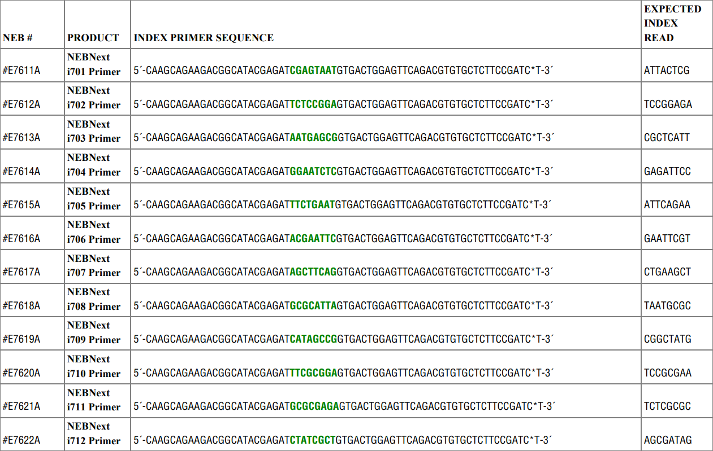
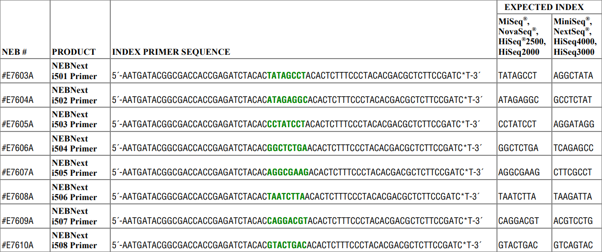
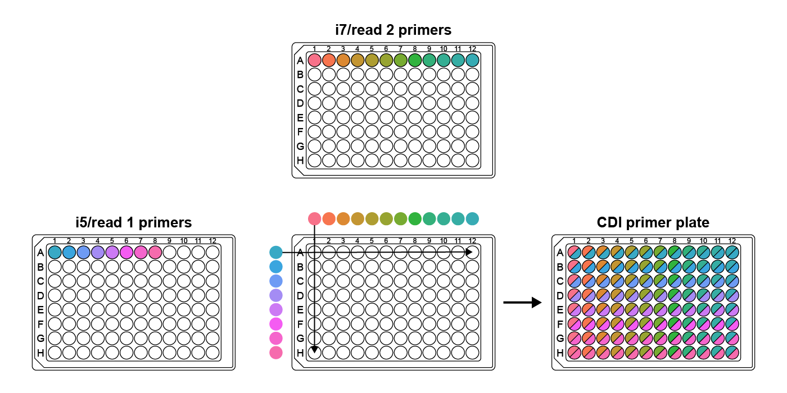

# GIL: Generate Indexes for Libraries

GIL is a Python package that designs indexing primers for multiplexed sequencing.

A web app version of GIL is available here: https://dbl-gil.streamlitapp.com/. If you encounter a message saying  the app is down/booting, please be patient and try again in 30 minutes. This can happen due to inactivitiy. 


# Installation

GIL requires Python 3.6 or higher and is not compatible with Python 2. The optional
[Levenshtein](https://pypi.org/project/Levenshtein/) module (`pip install Levenshtein`) makes index generation much faster but is not required.

## Installing from GitHub

To install GIL from GitHub, use

`pip install git+https://github.com/de-Boer-Lab/GIL`

GIL can then be run as follows:

`GIL [COMMAND] [ARGUMENTS]`

For help:

`GIL -h`

or  

`GIL [COMMAND] -h`

See [usage examples](#usage-examples) below for more details, and the [command line arguments](#command-line-arguments) section for explanations of all arguments.

## Running from a cloned repo

If you'd prefer not to install GIL, you can instead clone the repo:

`git clone https://github.com/de-Boer-Lab/GIL.git`

Commands can only be run from the top-level GIL directory as follows:

`python -m GIL.[COMMAND] [ARGUMENTS]`

For example, to generate indexes of length 10, run

`python -m GIL.generate_indexes --length 10`

# Introduction

Multiplex sequencing allows for many samples to be sequenced in a single
run, saving time and money. Unique index sequences are added to each sample
library so that the sample identity of each read can be determined.
Many sets of indexes are commercially available,
but these become quite costly for large numbers of samples.

To lower the cost of multiplex library preparation, we designed a program that
generates primers containing compatible indexes, which can be ordered as standard
oligos for a fraction of the cost of commercially-available indexing primers.
The program outputs primer sequences in a ready-to-order format and also generates
sample sheet templates for demultiplexing.

## Sequencing library structure

By default, the program generates primers compatible with Illumina TruSeq. This explanation focuses
on TruSeq, but note that you can generate primers for Nextera libraries or even custom library types if desired.

An Illumina TruSeq dual-indexed library has the following structure (adapted from the [Teichmann Lab's GitHub](https://teichlab.github.io/scg_lib_structs/methods_html/Illumina.html), a great resource for understanding how Illumina sequencing works):

<pre><span style="font-size: 12px">
5'- <span style="color: #08519C">AATGATACGGCGACCACCGAGATCTACAC</span><span>NNNNNNNN</span><span style="color: #6BAED6">ACACTCTTTCCCTACACGACGCTCTTCCGATCT</span>-insert-<span style="color: #FC9272">AGATCGGAAGAGCACACGTCTGAACTCCAGTCAC</span><span>NNNNNNNN</span><span style="color: #A50515">ATCTCGTATGCCGTCTTCTGCTTG</span> -3'
3'- <span style="color: #08519C">TTACTATGCCGCTGGTGGCTCTAGATGTG</span><span>NNNNNNNN</span><span style="color: #6BAED6">TGTGAGAAAGGGATGTGCTGCGAGAAGGCTAGA</span>-insert-<span style="color: #FC9272">TCTAGCCTTCTCGTGTGCAGACTTGAGGTCAGTG</span><span>NNNNNNNN</span><span style="color: #A50515">TAGAGCATACGGCAGAAGACGAAC</span> -5'
          <span style="color: #08519C">Illumina P5</span>               <span>i5</span>            <span style="color: #6BAED6">Truseq Read 1</span>                          <span style="color: #FC9272">Truseq Read 2</span>                 <span>i7</span>        <span style="color: #A50515">Illumina P7</span>
</span></pre>

The P5 and P7 sequences bind to the flow cell, and the Read 1 and Read 2 sequences bind to sequencing primers.

## Our indexing strategy

To add indexes to a library, inserts must be flanked with Read 1/Read 2 sequences.
These sequences can be added using ligation: e.g. NEBNext Adaptor for Illumina,
or the "stubby Y-yoke adaptor" from the [iTru Library Method](https://doi.org/10.7717/peerj.7755).
These sequences can also be added by PCR for sequencing inserts from a specific locus, such as in MPRA experiments.
The following diagram shows how our indexing primers anneal to a library of inserts
flanked with TruSeq Read 1/Read 2 sequences. The complementary
part of the primers was designed for a Tm of 65 °C with Q5 polymerase.

<pre><span style="font-size: 12px">
5'- <span style="color: #08519C">AATGATACGGCGACCACCGAGATCTACAC</span><span>NNNNNNNN</span><span style="color: #6BAED6">ACACTCTTTCCCTACACGACG</span> -3'
<span>                                     5'- <span style="color: #6BAED6">ACACTCTTTCCCTACACGACGCTCTTCCGATCT</span>-insert-<span style="color: #FC9272">AGATCGGAAGAGCACACGTCTGAACTCCAGTCAC</span> -3'
<span>                                     3'- <span style="color: #6BAED6">TGTGAGAAAGGGATGTGCTGCGAGAAGGCTAGA</span>-insert-<span style="color: #FC9272">TCTAGCCTTCTCGTGTGCAGACTTGAGGTCAGTG</span> -5' </span>
<span>                                                                                            3'- <span style="color: #FC9272">GTGCAGACTTGAGGTCAGTG</span><span>NNNNNNNN</span><span style="color: #A50515">TAGAGCATACGGCAGAAGACGAAC</span> -5'</span>
          <span style="color: #08519C">Illumina P5</span>               <span>i5</span>            <span style="color: #6BAED6">Truseq Read 1</span>                          <span style="color: #FC9272">Truseq Read 2</span>                 <span>i7</span>        <span style="color: #A50515">Illumina P7</span>
</span></pre>

# Command line arguments

## Arguments for index generation

The following arguments can be used to customize the indexes and primers generated with the `generate_indexes` command:

### --length

The length of the index. Default: 8.

### --dist

The minimum Levenshtein distance between generated indexes. Also used as the minimum distance
when filtering out sequences with the `--blocklist` argument. Default: 3.

### --sample-n

Number of indexes to randomly sample at the start. By default, this is 5000 for index length >= 10,
and for index length < 10, random sampling is not used (all possible indexes are generated at the start).
Using this argument for index length < 10 will override generating all possible indexes.

### --min-GC

The lower cutoff for GC content (percent). All indexes will have a strictly higher GC
content. Default: 25 (CGCATATT passes, CGATATTA fails).

### --max-GC

The upper cutoff for GC content (percent). All indexes will have a strictly lower GC
content. Default: 75 (CGCCGATT passes, CGGCGCTA fails).

### --max-homopolymer

The maximum length of homopolymer repeat that will be present in the generated indexes.
Default: 2 (CCAGTTAG passes, CCCTAGAC fails).

### --max-dinu

The maximum length of dinucleotide repeats that will be present in the generated indexes.
Default: 2 (ATATGCAC passes, ATATATCG fails).

### --allow-start-G

Allow index reads to start with G. Still filters out indexes that start with two Gs
(or i5 indexes that end with two Cs).

E.g. both GTATGCAC and GGTAATCG fail by default, but with this flag,
GTATGCAC passes while GGTAATCG still fails.

### --no-filter-self-priming

Don't filter indexes for high self-priming potential. By default, indexes with high
self-priming potential are filtered out.

### --library-type

Changes the type of library that primer sequences are designed for. Options: `TruSeq`, `Nextera`, or `custom`.
By default the program makes TruSeq-compatible primers. If `custom` is chosen, sequences for the 5' and 3' ends
of both forward and reverse primers must be supplied with the `--primer_sequences` option.

### --primer-sequences

Used to supply custom primer sequences. `--library_type custom` must be chosen to use this option.
Usage is `--primer_sequences "<forward 5'> <forward 3'> <reverse 5'> <reverse 3'>"`. For example,
supplying the default TruSeq sequences: `--primer_sequences "AATGATACGGCGACCACCGAGATCTACAC ACACTCTTTCCCTACACGACG CAAGCAGAAGACGGCATACGAGAT GTGACTGGAGTTCAGACGTG"`

### --library-name

The name that appears in all generated files. By default this is the same as `--library_type`,
which is TruSeq by default.

### --blocklist

The path to a file containing indexes that the generated indexes should be compatible with;
i.e. no generated indexes will have a Levenshtein distance of less than 3 to
any index in the blocklist.

The file should be a plain text file with one index per line. The index sequences should be the expected
index read (for i5 indexes, the expected read from MiniSeq®, NextSeq®, HiSeq4000, and HiSeq3000 machines).
This is the **reverse complement of the index sequence present in the primer**.

### --company

Format used for oligo order sheet. Different companies use different formats for their order sheets and for
specifying a phosphorothioate bond. Choices: `IDT`, `Thermo`, or `Sigma`. Eurofins uses the same format as IDT.
Default: `IDT`.

### --no-mod

For IDT and Sigma order sheets, don't add a '*' between the last two bases of the primers in the order sheet, which specifies a
phosphorothioate bond (protects primers against 3'-5' exonuclease activity of high fidelity polymerases). For Thermo, don't
add the letter code for phosphorothioate bond (a different letter for each base).
By default, this modification is added to primers in the order sheet.

### --seed

Seed for randomly selecting compatible sequences. Setting this allows for reproducible generation of indexes.
By default, sequences will be different each time the program is run (no seed).

### --out-dir

The path of the directory that all files will be saved to. By default,
this is "Output".

## Arguments for sample sheet creation

The following arguments can be can be used when making sample sheets
(e.g. for combinatorial dual index plates) with the `create_sample_sheets` command:

### --unique

Create sample sheets for unique dual indexes. By default create_sample_sheets.py will create
sample sheets for combinatorial dual indexes without this flag.

### --i7s

**Required**. Path to a TSV file containing i7 indexes, arranged according to their position in the 96-well plate
(8 rows of 12 indexes each). The sequence of the indexes should match the index sequence in the primer, **not** the
sequence read during sequencing.

### --i5s

**Required**. Path to a TSV file containing i5 indexes, arranged according to their position in the 96-well plate
(8 rows of 12 indexes each). The sequence of the indexes should match the index sequence in the primer, **not** the
sequence read during sequencing.

### --plate-name

**Required**. Name of the plate. This will appear in the sample sheet filename.

### --i7-row

Required unless `--unique` flag is used. The row (A-H) from the i7 plate used to make the CDI plate.

### --i5-row

Required unless `--unique` flag is used. The row (A-H) from the i5 plate used to make the CDI plate.

### --out-dir

The path to the directory that sample sheets will be saved to. Default is `Output/Sample_Sheets`, which is
the same directory that sample sheets are saved to when generating indexes.

# Overview of the index generation process

## Generate all possible indexes

Our program starts by generating a list of all possible indexes of the specified length (by default, all possible 8mers). For indexes of length > 9, a random sample of indexes is used, as
using all possible kmers would take too long.

## Remove starting G

In sequencers that use 2-channel chemistry (e.g. NovaSeq 6000), G is not labelled with
a fluorescent dye and the presence of G is inferred from a lack of signal. Illumina warns
that if the first two bases in the index are both G, "signal intensity is not generated."

To ensure that signal intensity is generated for every index, we remove any indexes that
start with G. For the i5 (read 2) index we also remove any indexes with a reverse complement
that begins with G, as this index may be read in either direction
depending on the sequencer used.

For a less stringent filtering, only sequences beginning with GG (and i5 ending
with CC) are removed. This filtering typically results in five plates
instead of three.

## Filter for GC content

Indexes with extreme GC content could lead to differences in PCR efficiency between
different primers. The program removes indexes with GC content less than 25% or
greater than 75%.

## Remove homopolymer and dinucleotide repeats

Homopolymer and dinucleotide repeats can cause issues such as polymerase stuttering
and mispriming. Runs of G can also cause issues during PCR due to [intermolecular stacking](http://cshprotocols.cshlp.org/content/2009/3/pdb.tab1ip65). We decided to remove indexes with
\>2 homopolymer or dinucleotide repeats to avoid these potential issues.

## Remove self-priming sequences

If an index is complementary to the 3' end of the primer, the 3' end of the primer
could fold back onto itself and be extended by the polymerase, ruining the primer.
To prevent this issue, we compute the Hamming distance between the
reverse complement of the 8 bases on the 3' end of the primer and all 8 nt windows that
include the index sequence. If any of these distances are \>3, the index is filtered out.

## Select a set of dissimilar sequences

After filtering, we choose a subset of the remaining sequences
such that no two sequences are too similar. To calculate similarity we use
[Levenshtein distance](https://en.wikipedia.org/wiki/Levenshtein_distance), which is the number
of substitutions, insertions, or deletions required to change one sequence to the other sequence.
We chose Levenshtein distance because it accounts for deletions, which are the most
common error in synthetic oligos. The [Levenshtein module](https://pypi.org/project/Levenshtein/) 
`distance` function, which is implemented in C, is used by default to calculate distance. If this
module isn't available, a much slower Python implementation of Levenshtein distance is used.

Before selecting the set of dissimilar sequences, the indexes can optionally be filtered to remove sequences that are
too similar to an existing set of indexes. For example, if you will be using these indexes
alongside commercial indexes such as NEBNext® Multiplex Oligos for Illumina®, you can ensure
that none of the generated indexes are too similar by using the `--blocklist` option along with
a file containing the indexes. A more detailed explanation of this option can be found in the
[command line arguments](#command-line-arguments) section.

To select this dissimilar set, we first select a random sequence from the set of filtered
indexes, then remove all sequences that are too similar to this sequence. We then repeat this
cycle of selecting a new sequence and removing all similar sequences until there are no more
indexes left to select from. This does not necessarily generate the largest possible set
of sequences, but it is much faster than trying to find this optimal set of dissimilar sequences
and with default settings we routinely get three 96-well plates of indexes.

## Group indexes for colour balance

When only a few indexes are used in a sequencing run, colour balance must be considered.
Most Illumina sequencers use one of two main technologies for imaging: 2-channel and
4-channel. A detailed explanation of why colour balance is important can be found
[here](https://support-docs.illumina.com/SHARE/IndexAdapterPooling/Content/SHARE/IndexAdapterPooling/SequencingChemistry_dtP.htm).
In short, during each sequencing cycle, multiple images are taken using different colours of light,
as the fluorescent dyes attached to the bases are excited at different wavelengths. If all of the
bases at a certain position in the indexes are imaged in the same channel, the other channel will
be completely dark, which can cause the run to fail. It is therefore important that the
correct diversity of bases is present at each position in the set of indexes used in a run.

The program outputs indexes such that each group of four indexes along the rows of the plate
is colour balanced. This allows for multiplexing of as few as four indexes without having to worry
about colour balance.

# Output

By default, all output files are placed in a directory named `Output` at the top level of the IndexingLibrary directory.
The output directory has the following structure:

    Output
      |- Order_Sheets
      |- Plates
      |  |- Indexes
      |  |  |- i7
      |  |  |- i5
      |  |- Primers
      |- Sample_sheets

`Order_Sheets` contains two CSV files for each plate generated, containing the i7 and i5 primers
in a format that is ready to be ordered. 

`Indexes` contains TSV files of indexes for each plate generated. The indexes are arranged in a
standard 96-well format. Note that these are the exact sequences (5' to 3') found in the
indexing primers, **not** the index sequences that will be read by the sequencer.

`Primers` contains TSV files of the indexing primers for each plate generated. They are arranged
identically to the index TSV files but contain the entire primer sequence, not just the index.

`Sample_Sheets` contains a CSV file for each plate generated which provides the index sequences
in each well for sample demultiplexing. Because different sequencers read the i5 index in different directions,
there are two columns for the i5 index sequence. The first column is for the "forward strand workflow",
where the index read by the sequencer matches the 5'-3' sequence of the index present in the adapter primer.
The second column is for the "reverse strand workflow", which reads the reverse complement of the sequence present
in the adapter primer.

The top of the sample sheet explains which i5 column to use for different Illumina instruments. If you do not
already have an Illumina sample sheet template, templates for v1 and v2 sample sheets can be found in the `templates` directory.
Paste the i7 and i5 index columns for your samples into the index and index2 columns in the data section, respectively.

# Unique vs Combinatorial Dual Indexes

Two indexing strategies are possible with dual indexes. Unique dual indexing (UDI) uses a unique
read 1 index and a unique read 2 index for each sample. As the number of samples increases,
this can get expensive, as two new indexing primers are needed for each new sample. Combinatorial
dual indexing (CDI) solves this problem by using indexes multiple times while ensuring that
each pair of indexes is unique. Using CDI, only 20 primers are needed to index 96 samples, while
192 primers would be required with UDI.

An illustration of CDI vs UDI from the Illumina website:


Why use UDI then? Something called [index hopping](https://www.illumina.com/techniques/sequencing/ngs-library-prep/multiplexing/index-hopping.html)
can occur during sequencing, especially on certain sequencers. Index hopping is when one of the
indexes from one sample occurs in a different sample. If this happens with UDIs, the index pairing
will be invalid and the read can be thrown out. With CDIs, however, because indexes are shared between
samples, index hopping could lead to an index combination that is still valid. This read would then be
assigned to the wrong sample.

## Generating Combinatorial Index Plates

By default, `generate_indexes.py` creates plates for the UDI indexing strategy: 96 i7 and 96 i5 primers for
each plate generated. One set of 96 primer pairs for UDI can be expanded to 64 plates of CDI primers, which can
index 6,144 samples. To do this, simply choose one row from the i7 plate and one row from the i5 plate.
The 12 i7 indexes from the row are copied down the columns of the new plate, and the first 8 indexes
of the i5 row are copied along the rows of the new plate.

Sample sheets for CDI plates can be created using `create_sample_sheets.py`. Specify the rows of the original
UDI plates that the i7 and i5 primers were taken from, and the path to the TSV file containing the indexes for
the original UDI plate. For a detailed example, see [below](#making-cdi-plates).

# Usage examples

## Default settings

To generate 8 bp indexes in TruSeq-compatible primers with default filtering parameters, simply run:
```
GIL generate_indexes
```


All generated files can be found in `Output` in the directory the command was run from.

## Using a blocklist

Suppose you will be pooling your libraries with existing sets of indexes, for example
[NEBNext® Multiplex Oligos for Illumina® (Dual Index Primers Set 1)](https://international.neb.com/products/e7600-nebnext-multiplex-oligos-for-illumina-dual-index-primers-set-1#Product%20Information).
You can ensure that all of your generated indexes are compatible with this existing set by using the `--blocklist` option.

In the manual you can find the index sequences for i7:


and i5:


Note that the expected index read is usually the reverse complement of the index sequence present in the primer, except for i5
indexes with certain sequencers. It's important that **the indexes in the blocklist are the reverse complement of the index
sequence present in the primer**; i.e. the blocklist indexes should be the expected index read for MiniSeq®, NextSeq®, HiSeq4000, HiSeq3000.

To generate indexes that are compatible with this NEB index set, create a text file (let's call it `NEB_indexes.txt`) containing one index per line:
```
AGGCTATA
GCCTCTAT
AGGATAGG
TCAGAGCC
CTTCGCCT
TAAGATTA
ACGTCCTG
GTCAGTAC
ATTACTCG
TCCGGAGA
CGCTCATT
GAGATTCC
ATTCAGAA
GAATTCGT
CTGAAGCT
TAATGCGC
CGGCTATG
TCCGCGAA
TCTCGCGC
AGCGATAG
```

Place this file somewhere, then supply the path to this file after the `--blocklist` argument:

```
GIL generate_indexes --blocklist NEB_indexes.txt
```
All generated indexes will have a Levenshtein distance of at least 3 from any index present in the NEB index set, and libraries indexed
with your generated indexes can be pooled with libraries indexed with this NEB set without index collisions.


## Using custom primer sequences

You can specify custom primer sequences if you will be using the indexing primers for specialized NGS methods that don't use the standard
Nextera or TruSeq adaptor sequences. Let's say you want your libraries to look like this:

```
5'-TAAAAAAAAAACNNNNNNNNGCCCCCCCCCCA-insert-CTTTTTTTTTTANNNNNNNNACCCCCCCCCCG-3'
3'-ATTTTTTTTTTGNNNNNNNNCGGGGGGGGGGT-insert-GAAAAAAAAAATNNNNNNNNTGGGGGGGGGGC-5'
              idx2 (i5)   read 1              read 2   idx1 (i7)
```

This means your forward/read 1/index 2/i5 primer should look like this:
```
5'-TAAAAAAAAAACNNNNNNNNGCCCCCCCCCCA-3'
```

and your reverse/read 2/index 1/i7 primer should look like this:
```
5'-CGGGGGGGGGGTNNNNNNNNTAAAAAAAAAAG-3'
```

To make indexing primers that will create this library structure, run the following:
```
GIL generate_indexes --library_type custom --primer_sequences "TAAAAAAAAAAC GCCCCCCCCCCA CGGGGGGGGGGT TAAAAAAAAAAG" --library_name Useless-Seq
```

The `--library_name` argument is optional and replaces "custom" in the output file names with the name of your custom library type.

## Changing index length and minimum distance between indexes

By default the generated indexes have a length of 8, and the parameters for filtering were designed with this length in mind. This default length
can be changed by using the `--length` argument. For indexes longer than 9 nt, a random sample of 5,000 starting indexes is used instead of using all possible indexes, as 
the total number of indexes possible is too large to process in a reasonable amount of time. The size of this random sample can be changed with the `--sample-n` argument.

For longer indexes, you may want the minimum distance between sequences to be larger. This can be changed with the `--dist` argument. Larger distances will require a larger
initial random sample to generate a sufficient number of indexes.

For example, if you want indexes of length 10 with a minimum distance of 4 between any two indexes, you can run the following:
```
GIL generate_indexes --dist 4 --length 10
```

This only generates two plates of indexes because the distance filtering is more strict. If you want more plates, you can change `--sample-n` from the default 5000:
```
GIL generate_indexes --dist 4 --length 10 --sample-n 100000
```

This still runs in a reasonable amount of time, but now four plates of indexes are generated instead of two.

## Making CDI plates

CDI plates can be created from UDI plates by copying a row of i5 primers across the rows of the
CDI plate and copying a row of i7 primers down the columns of the CDI plate, as shown in the diagram:



This creates 96 unique pairs of indexes while only using 20 primers. It's important to use rows for
both the i5 and i7 primers because indexes are colour balanced in groups of four across the rows
of the UDI plate. If a column of i5 primers was used (which makes more sense at first glance), the
CDI plate would not be guaranteed to be colour balanced. Using rows from the UDI plate ensures
that the CDI plate is colour balanced in blocks of 4x4 indexes.

Let's assume that you've created the CDI plate from the first i5 and i7 plates generated by GIL.
To create a sample sheet for this new CDI plate, run the following:
```
GIL create_sample_sheets --i7s Output/Plates/Indexes/i7/TruSeq_i7_Indexes_Plate_1.tsv --i5s Output/Plates/Indexes/i5/TruSeq_i5_Indexes_Plate_1.tsv --i7-row A --i5-row A --plate-name CDI_plate1_i5A_i7A
```

Under `Output/Sample_Sheets` you should now see a new sample sheet: `CDI_plate1_i5A_i7A_sample_sheet.csv`
Note that `--plate-name` is a required argument, but it can be whatever you want.

# Testing

If you've modified the code and you'd like to run our tests, run
```
python -m unittest
```
from the top level GIL directory.

# Ordering primers

## Phosphorothioate modification

Most commercial NGS primers contain a phosphorothioate modification between the last two nucleotides on the 3' end, which protects against primer degradation by the
3'-5' exonuclease activity of high-fidelity polymerases.
By default, primers in the order sheet contain an asterisk to specify that a phosphorothioate modification should be added (this code is used by IDT, Sigma, and Eurofins).
Thermo's code is different (a different letter code for each base), but you can also generate primers for ordering from Thermo by using the `--company Thermo` argument.
This costs ~$4 per primer with IDT, and can be removed with the `--no-mod` option.

## Oligo quality

We ordered our indexing primers as standard 100 nmol oligos from IDT, with only standard desalting for purification. Higher quality oligos, such as IDT Ultramers,
will likely result in better quality sequencing data, but come at a much higher cost. We observed ~0.2% of reads with deletions in the index region for our 8 bp dual index primers, while the higher quality PhiX spike-in had only ~0.02% deletions.

## Preparing primer plates

We ordered our oligos in TE buffer normalized to 100 μM concentration in multiple replicate plates. We created "master plates"
by diluting the i5 and i7 indexes into a single 96-well plate (polypropylene is preferable to polystyrene due to lower DNA binding) to a final concentration
of 10 μM each primer. We then aliquoted each master plate into multiple single-use plates to prevent index contamination between wells.
